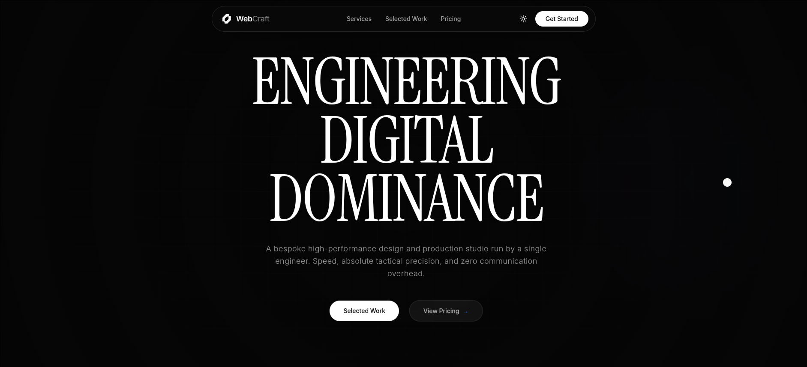

# Web-Craft- Transform your Buisness With Digital Solution



A production-ready, ultra-high-performance digital ecosystem engineered for elite solo studios and solopreneurs. Built with Svelte 5 (Runes), Tailwind CSS v4, and GSAP, this platform transforms traditional portfolio structures into a high-converting, productized service machine.

## Architecture & Stack

- **Framework:** Svelte 5 (Runes) + SvelteKit (SSG Mode via Prerender & CSR)
- **Styling:** Tailwind CSS v4 (Custom Light/Dark Tokens)
- **Animation Engine:** GSAP 3 (ScrollTrigger, ScrollToPlugin)
- **Scroll Hook:** Lenis (Smooth Scroll Architecture)
- **Operations Integration:** Cal.com Global Embed Engine

## Core Capabilities

- **Dual-State Theme Engine:** Zero-hydration flicker Dark/Light mode switching powered by Svelte reactive states and persistent local storage sync.
- **Productized Investment Structure:** Hardcoded subscription and fixed-scope pricing architectures designed to bypass traditional corporate friction.
- **In-App Booking Automations:** Native Cal.com iframe overlay overlays directly into the viewport, avoiding third-party redirects and securing higher conversion rates.
- **Hardware-Accelerated Stacking:** Dynamic sticky panel grids that natively scale and dim underlying structural layers via GSAP ScrollTrigger.
- **Fluid Navigation Engine:** Custom GSAP implementations for zero-latency anchor traversals and glassy, floating navigation bars.

## Local Environment

Ensure you have Node.js (v20+) installed on your machine.

```bash
# Install node packages
npm install

# Initialize the Vite development server
npm run dev

# Compile the production bundle
npm run build
