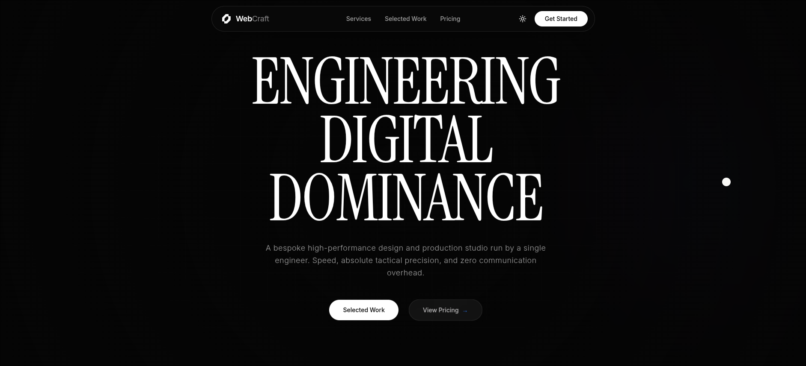

# Web-Craft - Transform your Business With Digital Solution



A production-ready, ultra-high-performance digital ecosystem engineered for elite solo studios and solopreneurs. Built with Svelte 5 (Runes), Tailwind CSS v4, and GSAP, this platform transforms traditional portfolio structures into a high-converting, productized service machine.

## Architecture & Stack

- **Framework:** Svelte 5 (Runes) + SvelteKit (SSG Mode via Prerender & CSR)
- **Styling:** Tailwind CSS v4 (Custom Light/Dark Tokens)
- **Animation Engine:** GSAP 3 (ScrollTrigger, ScrollToPlugin)
- **Scroll Hook:** Lenis (Smooth Scroll Architecture)
- **Operations Integration:** Cal.com Global Embed Engine

## Core Capabilities

- **Dual-State Theme Engine:** Zero-hydration flicker Dark/Light mode switching powered by Svelte reactive states and persistent local storage sync.
- **Productized Investment Structure:** Hardcoded subscription and fixed-scope pricing architectures designed to bypass traditional corporate friction.
- **In-App Booking Automations:** Native Cal.com iframe overlay overlays directly into the viewport, avoiding third-party redirects and securing higher conversion rates.
- **Hardware-Accelerated Stacking:** Dynamic sticky panel grids that natively scale and dim underlying structural layers via GSAP ScrollTrigger.
- **Fluid Navigation Engine:** Custom GSAP implementations for zero-latency anchor traversals and glassy, floating navigation bars.

## Project Structure

```
├── src/
│   ├── lib/          # Reusable components and utilities
│   ├── routes/       # SvelteKit page routes
│   ├── app.html      # Root HTML template
│   └── app.css       # Global styles
├── static/           # Static assets (images, fonts, etc.)
├── package.json      # Project dependencies and scripts
├── svelte.config.js  # SvelteKit configuration
├── tailwind.config.js # Tailwind CSS configuration
└── vite.config.js    # Vite build configuration
```

## Local Environment

Ensure you have Node.js (v20+) installed on your machine.

```bash
# Install node packages
npm install

# Initialize the Vite development server
npm run dev

# Compile the production bundle
npm run build

# Preview the production build locally
npm run preview

# Run linting checks
npm run lint

# Format code with Prettier
npm run format
```

## Scripts Explained

| Command | Description |
|---------|-------------|
| `npm run dev` | Starts the development server with hot module replacement |
| `npm run build` | Creates an optimized production build |
| `npm run preview` | Serves the production build locally for testing |
| `npm run lint` | Runs ESLint to check code quality |
| `npm run format` | Formats code using Prettier |

## Deployment

This project is optimized for deployment on Vercel, Netlify, or any static hosting platform:

1. Run `npm run build` to generate the production files
2. Deploy the `.svelte-kit/output/static` directory to your hosting provider
3. Ensure your host supports single-page application routing (if needed)

### Vercel Deployment

```bash
# Install Vercel CLI
npm i -g vercel

# Deploy
vercel
```

## Browser Support

- Chrome (latest)
- Firefox (latest)
- Safari (latest)
- Edge (latest)

## Contributing

1. Fork the repository
2. Create a feature branch (`git checkout -b feature/amazing-feature`)
3. Commit your changes (`git commit -m 'Add amazing feature'`)
4. Push to the branch (`git push origin feature/amazing-feature`)
5. Open a Pull Request

## License

This project is licensed under the MIT License - see the LICENSE file for details.

## Contact

For inquiries and collaborations, please visit our booking page integrated via Cal.com or open an issue in this repository.